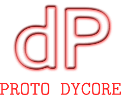

# proto_dycore

Prototype design of a field management layer for a dycore using GridTools. 
The design contains several concepts: 
 
 * a `context`: that describes the list of fields that belong and are allocated/used within this context. 
Examples of a `context` are, a vertical advection operator, a fast waves framework, a time integrator or a full dycore. 
Contexts are inclusive, i.e. when a context is activated, all fields belonging to already activated `contexts` will be inhereted. 
Like that a fast waves context is included in a dycore `context`, meaning that the fast waves can access any field declared in the dycore
context without having to declare it for its specific `context`
 * a `repository`: stores and manages all fields associated to a `context`. Fields are stored in tuples, and the repository can handle all types of storages, i.e. 3d fields, 2d fields, etc. 
 * a `field pool`: emulates a memory pool, by giving access to the user *only* to fields of active contexts. The `field pool` contains all the repositories defined in the dycore (one per each `context`)
and additionally handles all the placeholders defined in the different contexts

For a quick look at the workflow defined by this proposal, see 
[main.cpp](main.cpp)

All the code compiles, and runs, although it deals with memory management only, and therefore does not build nor compute any stencil. 

